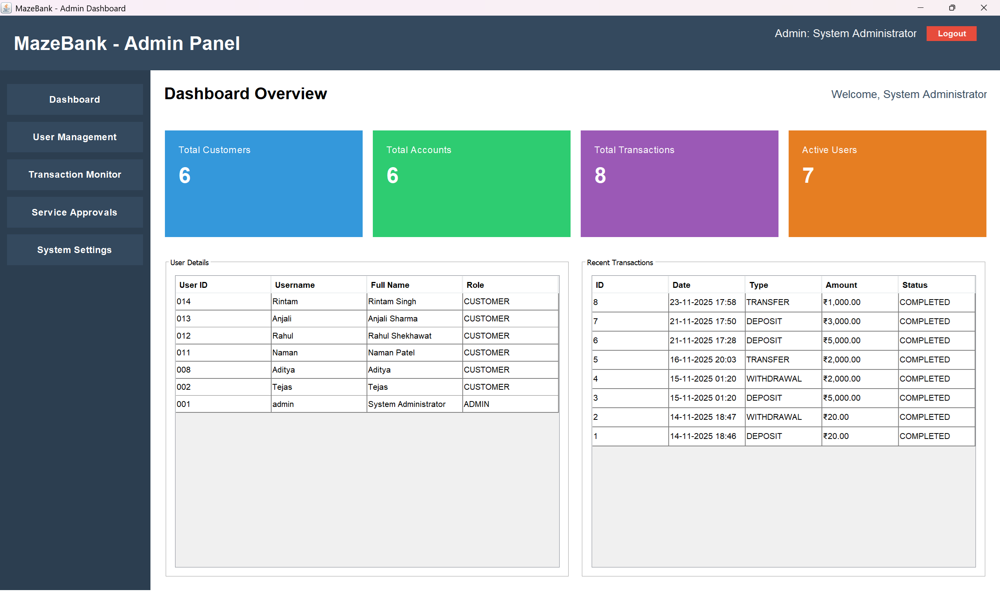
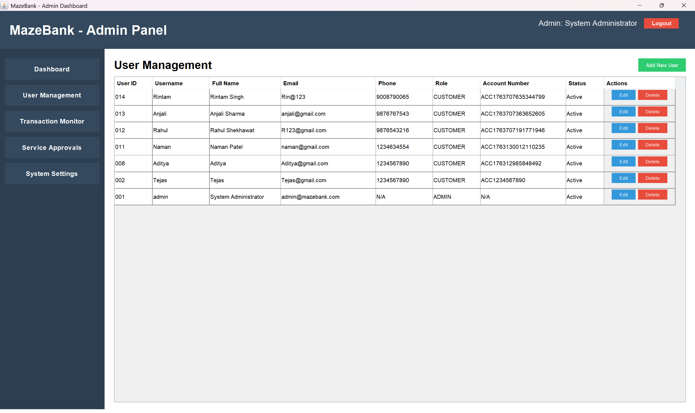
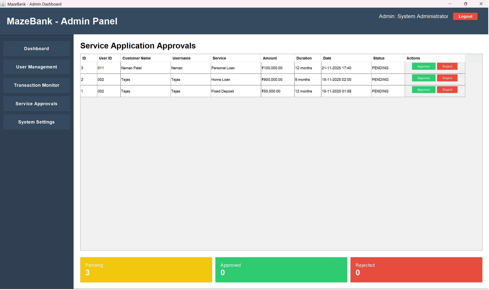

# MazeBank - Online Banking System
## Overview

MazeBank is a fully functional desktop-based online banking simulation system built using Java Swing and MySQL. It allows customers to manage accounts, perform secure transactions, view detailed histories, and apply for various banking services. Administrators can manage users, monitor activities, and oversee all system operations. The system replicates real-world banking workflows and includes features such as multithreaded transaction handling, secure authentication, and a structured MVC architecture.

**Technology Stack:** Java 23 | Swing GUI | MySQL | JDBC | MVC Architecture

## Features

### For Customers
- View account balance and details
- Deposit and withdraw money
- Transfer funds between accounts
- View complete transaction history
- Apply for banking services (loans, investments, etc.)
- Update profile and change password

### For Administrators
- Dashboard with system statistics
- User management (add, edit, delete users)
- Monitor all transactions
- View system-wide reports
- Configure system settings

## Technology Stack

- **Language**: Java 23
- **GUI Framework**: Java Swing
- **Database**: MySQL 5.7+
- **JDBC Driver**: MySQL Connector/J 8.0.33
- **Architecture**: MVC Pattern with DAO interfaces

### Architecture Highlights
- **OOP**: Interfaces, inheritance, polymorphism, custom exceptions
- **Multithreading**: Background processor with thread synchronization
- **Collections**: Generic lists, concurrent maps, blocking queues
- **JDBC**: Atomic transactions with commit/rollback
- **Thread Safety**: Per-account locks to prevent race conditions

## Quick Start

### Prerequisites

1. **Java JDK 23** - [Download](https://www.oracle.com/java/technologies/downloads/)
2. **MySQL Server 5.7+** - [Download](https://dev.mysql.com/downloads/mysql/)
3. **MySQL JDBC Driver** - [Download](https://dev.mysql.com/downloads/connector/j/)
   - Place `mysql-connector-j-8.0.33.jar` in the `lib/` folder

### Installation

**1. Setup Database**

```sql
-- In MySQL Workbench or command line:
source database/schema.sql
```

**2. Configure Connection**

Edit `src/com/mazebank/util/DatabaseConnection.java`:
```java
private static final String URL = "jdbc:mysql://localhost:3306/mazebank_db";
private static final String USERNAME = "root";
private static final String PASSWORD = "your_password";
```

**3. Compile and Run**

```powershell
# Navigate to project
cd d:\TejasPC\MazeBank

# Compile all sources
$srcs = Get-ChildItem -Recurse -Path src -Filter *.java | ForEach-Object { $_.FullName }
javac -d bin -cp "lib/*" $srcs

# Run application
java -cp "bin;lib/*" com.mazebank.Main
```

Or simply run: `run.bat`

## Default Login

**Admin Account**
- Username: `Admin`
- Password: `admin123`

**Customer Accounts**
- Username: `Customer` | Password: `Customer123`
- Example :
- Username: `Tejas` | Password: `Tejas123`

*Or register a new account through the application (minimum deposit: 500)*

## Screenshots

### Login Screen


### Customer Dashboard

*View balances, recent transactions, and perform quick actions*

### Transaction History

*Complete transaction log with filtering options*

### Banking Services

*Browse available services (loans, investments) and apply*

### Profile Management

*Update personal details and change password securely*

### Admin Dashboard

*System statistics and user management overview*

### User Management

*Add, edit, and manage user accounts*

### Service Approval (Admin)

*Review and approve or reject customer service applications*

## Project Structure

```
MazeBank/
├── src/com/mazebank/
│   ├── Main.java
│   ├── model/                  # Data models
│   │   ├── Account.java (base class)
│   │   ├── SavingsAccount.java
│   │   ├── CurrentAccount.java
│   │   ├── User.java
│   │   ├── Transaction.java
│   │   └── BankingService.java
│   ├── dao/                    # DAO interfaces + implementations
│   │   ├── IAccountDAO.java
│   │   ├── AccountDAO.java
│   │   ├── IUserDAO.java
│   │   ├── UserDAO.java
│   │   ├── ITransactionDAO.java
│   │   ├── TransactionDAO.java
│   │   ├── IBankingServiceDAO.java
│   │   └── BankingServiceDAO.java
│   ├── service/                # Business logic
│   │   └── TransactionService.java (thread-safe transfers)
│   ├── exceptions/             # Custom exceptions
│   │   ├── InsufficientFundsException.java
│   │   └── InvalidTransactionException.java
│   ├── ui/                     # User interface
│   │   ├── LoginFrame.java
│   │   ├── RegistrationFrame.java
│   │   ├── CustomerDashboard.java
│   │   └── AdminDashboard.java
│   └── util/                   # Utilities
│       ├── DatabaseConnection.java
│       └── TransactionProcessor.java
├── database/
│   └── schema.sql
├── lib/
│   └── mysql-connector-j-8.0.33.jar
└── screenshots/
```

## Database Schema

**Tables**
- `users` - User accounts with roles (admin/customer)
- `accounts` - Bank accounts (savings/current)
- `transactions` - All financial transactions
- `banking_services` - Available services (loans, investments)
- `customer_services` - Service applications and status

## Troubleshooting

**Database Connection Failed**
- Verify MySQL is running on port 3306
- Check credentials in `DatabaseConnection.java`
- Ensure `mazebank_db` database exists

**JDBC Driver Not Found**
- Download MySQL Connector/J
- Place JAR in `lib/` folder
- Verify classpath includes `lib/*`

**Compilation Errors**
```powershell
# Ensure you compile from project root with all sources:
cd d:\TejasPC\MazeBank
$srcs = Get-ChildItem -Recurse -Path src -Filter *.java | ForEach-Object { $_.FullName }
javac -d bin -cp "lib/*" $srcs
java -cp "bin;lib/*" com.mazebank.Main
```
**Acknowledgments**: GUVI Geek Network | MySQL | Oracle JDK

For issues or questions, refer to the troubleshooting section above.

