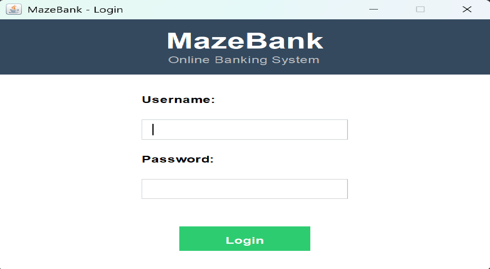
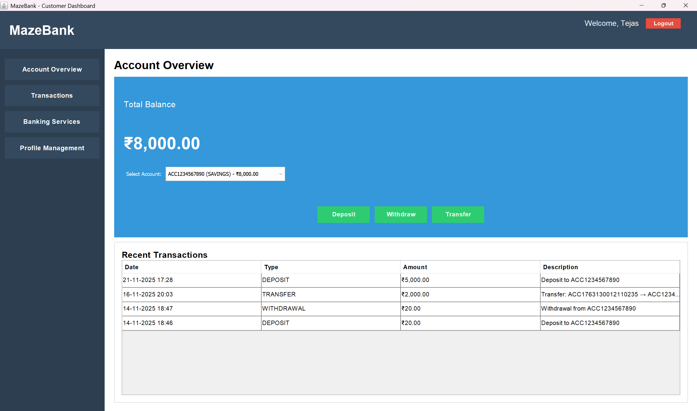
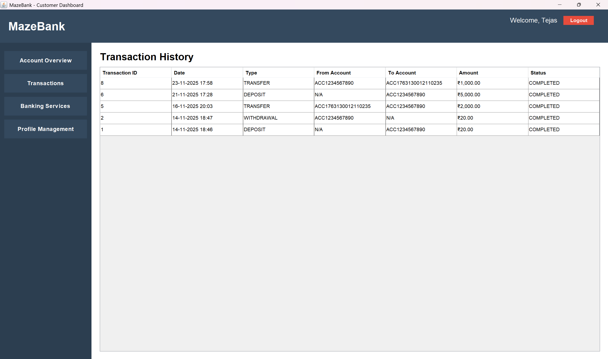
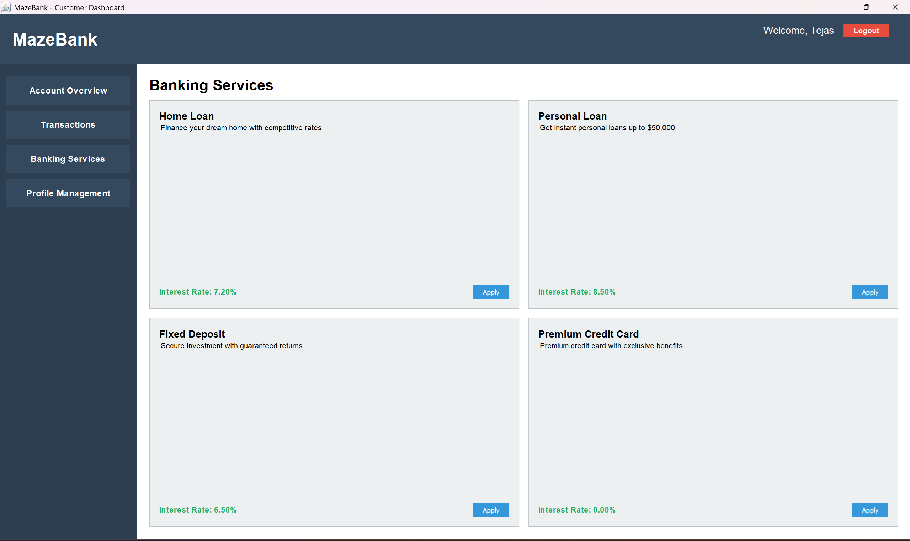
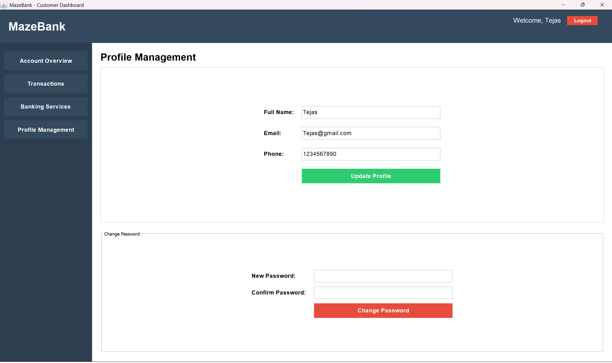

# MazeBank - Online Banking System
## Overview

MazeBank is a comprehensive banking simulation system with **dual deployment modes**: a desktop GUI application and a RESTful web API backend. The system provides full banking functionality including account management, secure transactions, transaction history, and banking services. The RESTful API enables integration with mobile apps, web frontends, and third-party services.

**Technology Stack:** Java 23 | Jakarta Servlets | Apache Tomcat 10 | Swing GUI | MySQL | JDBC | MVC Architecture | RESTful API

## Features

### For Customers
- View account balance and details
- Deposit and withdraw money
- Transfer funds between accounts
- View complete transaction history
- Apply for banking services (loans, investments, etc.)
- Update profile and change password

### For Administrators
- Dashboard with system statistics
- User management (add, edit, delete users)
- Monitor all transactions
- View system-wide reports
- Configure system settings

### RESTful API Features
- **Authentication**: Session-based login/logout with secure cookies
- **Account Management**: Create, view, and manage bank accounts via API
- **Transactions**: Deposits, withdrawals, and fund transfers
- **Transaction History**: Retrieve complete transaction logs
- **User Registration**: Create new customer accounts programmatically
- **Session Management**: Validate active sessions and retrieve user profiles

## Technology Stack

- **Language**: Java 23
- **Backend Framework**: Jakarta Servlet 5.0 (Jakarta EE 9+)
- **Server**: Apache Tomcat 10.1.28
- **GUI Framework**: Java Swing
- **Database**: MySQL 5.7+
- **JDBC Driver**: MySQL Connector/J 8.0.33
- **JSON Processing**: Jackson Databind 2.16.0
- **Architecture**: MVC Pattern with DAO interfaces + REST API

### Architecture Highlights
- **OOP**: Interfaces, inheritance, polymorphism, custom exceptions
- **Multithreading**: Background processor with thread synchronization
- **Collections**: Generic lists, concurrent maps, blocking queues
- **JDBC**: Atomic transactions with commit/rollback
- **Thread Safety**: Per-account locks to prevent race conditions

## Quick Start

### Prerequisites

1. **Java JDK 23** - [Download](https://www.oracle.com/java/technologies/downloads/)
2. **MySQL Server 5.7+** - [Download](https://dev.mysql.com/downloads/mysql/)
3. **MySQL JDBC Driver** - [Download](https://dev.mysql.com/downloads/connector/j/)
   - Place `mysql-connector-j-8.0.33.jar` in the `lib/` folder

### Installation

**1. Setup Database**

```sql
-- In MySQL Workbench or command line:
source database/schema.sql
```

**2. Configure Connection**

Edit `src/com/mazebank/util/DatabaseConnection.java`:
```java
private static final String URL = "jdbc:mysql://localhost:3306/mazebank_db";
private static final String USERNAME = "root";
private static final String PASSWORD = "your_password";
```

**3. Run Desktop Application**

```powershell
# Windows
run.bat

# Or manually:
cd d:\TejasPC\MazeBank
java -cp "bin;lib/*" com.mazebank.Main
```

### RESTful API Deployment (Apache Tomcat 10.1.28)

**Implemented Servlets (8 Total):**

1. **LoginServlet** - `POST /api/login` - User authentication with session creation
2. **RegistrationServlet** - `POST /api/register` - New user registration
3. **LogoutServlet** - `GET/POST /api/logout` - Session termination
4. **SessionServlet** - `GET /api/session` - Session validation and profile retrieval
5. **AccountServlet** - `GET /api/account`, `POST /api/account`, `GET /api/account/{id}` - Account operations
6. **TransactionServlet** - `POST /api/transfer`, `GET /api/transactions`, `GET /api/transactions/account/{id}` - Fund transfers and history
7. **DepositServlet** - `POST /api/deposit` - Deposit funds
8. **WithdrawServlet** - `POST /api/withdraw` - Withdraw funds

**Deployment Steps:**

1. **Prerequisites:**
   - Apache Tomcat 10.1.28+ installed at `C:\tomcat\apache-tomcat-10.1.28`
   - Java JDK 23
   - MySQL Server running with `mazebank_db` database

2. **Start Tomcat Server:**
```powershell
cd C:\tomcat\apache-tomcat-10.1.28
bin\catalina.bat run
```

3. **Verify Deployment:**
   - Server should start on port 8080
   - MazeBank app deployed at `http://localhost:8080/MazeBank/api`

**API Testing Examples:**

```powershell
# Test login endpoint (GET - should return 405)
curl.exe -i http://localhost:8080/MazeBank/api/login

# Authenticate user (POST)
curl.exe -X POST "http://localhost:8080/MazeBank/api/login?username=admin&password=admin123"

# Register new user
curl.exe -X POST "http://localhost:8080/MazeBank/api/register?username=john&email=john@test.com&password=pass123&fullName=John Doe"

# Get user accounts (requires sessionId from login response)
curl.exe "http://localhost:8080/MazeBank/api/account?sessionId=YOUR_SESSION_ID"

# Create new account
curl.exe -X POST "http://localhost:8080/MazeBank/api/account?accountType=SAVINGS&initialBalance=1000"

# Deposit funds
curl.exe -X POST "http://localhost:8080/MazeBank/api/deposit?accountId=1&amount=500"

# Withdraw funds
curl.exe -X POST "http://localhost:8080/MazeBank/api/withdraw?accountId=1&amount=200"

# Transfer funds
curl.exe -X POST "http://localhost:8080/MazeBank/api/transfer?fromAccountId=1&toAccountId=2&amount=100&description=Payment"

# Get transaction history
curl.exe "http://localhost:8080/MazeBank/api/transactions"

# Logout
curl.exe "http://localhost:8080/MazeBank/api/logout"
```

## API Endpoints Reference

| Method | Endpoint | Purpose | Parameters |
|--------|----------|---------|------------|
| POST | `/api/login` | User authentication | username, password |
| POST | `/api/register` | User registration | username, email, password, fullName |
| GET | `/api/session` | Validate session & get profile | sessionId (cookie) |
| GET/POST | `/api/logout` | Logout user | sessionId (cookie) |
| GET | `/api/account` | List user accounts | sessionId (cookie) |
| GET | `/api/account/{id}` | Get account details | id (path), sessionId (cookie) |
| POST | `/api/account` | Create new account | accountType, initialBalance |
| POST | `/api/transfer` | Transfer funds | fromAccountId, toAccountId, amount, description |
| GET | `/api/transactions` | View all transactions | sessionId (cookie) |
| GET | `/api/transactions/account/{id}` | Account transactions | id (path) |
| POST | `/api/deposit` | Deposit funds | accountId, amount |
| POST | `/api/withdraw` | Withdraw funds | accountId, amount |

### Expected Response Format

**Success Response:**
```json
{
  "success": true,
  "message": "Operation successful",
  "data": { /* response data */ }
}
```

**Error Response:**
```json
{
  "success": false,
  "message": "Error description",
  "error": "Error details"
}
```

## Security Features

- ✅ Session-based authentication with 30-minute timeout
- ✅ Per-account transaction locks for thread safety
- ✅ Prepared statements to prevent SQL injection
- ✅ BigDecimal for precise monetary calculations
- ✅ Role-based access control (ADMIN/CUSTOMER)
- ✅ HttpOnly cookies for session protection

## Default Login

**Admin Account**
- Username: `Admin`
- Password: `admin123`

**Customer Accounts**
- Username: `Customer` | Password: `Customer123`
- Example :
- Username: `Tejas` | Password: `Tejas123`

*Or register a new account through the application (minimum deposit: 500)*

## Screenshots

### Login Screen


### Customer Dashboard

*View balances, recent transactions, and perform quick actions*

### Transaction History

*Complete transaction log with filtering options*

### Banking Services

*Browse available services (loans, investments) and apply*

### Profile Management

*Update personal details and change password securely*

### Admiservlet/                # RESTful API servlets
│   │   ├── LoginServlet.java
│   │   ├── RegistrationServlet.java
│   │   ├── LogoutServlet.java
│   │   ├── SessionServlet.java
│   │   ├── AccountServlet.java
│   │   ├── TransactionServlet.java
│   │   ├── DepositServlet.java
│   │   └── WithdrawServlet.java
│   ├── exceptions/             # Custom exceptions
│   │   ├── InsufficientFundsException.java
│   │   └── InvalidTransactionException.java
│   ├── ui/                     # User interface (Swing)
│   │   ├── LoginFrame.java
│   │   ├── RegistrationFrame.java
│   │   ├── CustomerDashboard.java
│   │   └── AdminDashboard.java
│   └── util/                   # Utilities
│       ├── DatabaseConnection.java
│       └── TransactionProcessor.java
├── web/WEB-INF/
│   └── web.xml                 # Servlet configuration
├── war_build/                  # WAR deployment package
│   ├── WEB-INF/
│   │   ├── classes/            # Compiled servlet classes
│   │   ├── lib/                # Dependencies (Jackson, JDBC)
│   │   └── web.xml
├── database/
│   └── schema.sql
├── lib/
│   ├── mysql-connector-j-8.0.33.jar
│   ├── jakarta.servlet-api-5.0.0.jar
│   ├── jackson-databind-2.16.0.jar
│   ├── jackson-core-2.16.0.jar
│   └── jackson-annotations-2.16.0
MazeBank/
├── src/com/mazebank/
│   ├── Main.java
│   ├── model/                  # Data models
│   │   ├── Account.java (base class)
│   │   ├── SavingsAccount.java
│   │   ├── CurrentAccount.java
│   │   ├── User.java
│   │   ├── Transaction.java
│   │   └── BankingService.java
│   ├── dao/                    # DAO interfaces + implementations
│   │   ├── IAccountDAO.java
│   │   ├── AccountDAO.java
│   │   ├── IUserDAO.java
│   │   ├── UserDAO.java
│   │   ├── ITransactionDAO.java
│   │   ├── TransactionDAO.java
│  System Requirements

- **Java**: JDK 23 or higher
- **Servlet Container**: Apache Tomcat 10.1.28+ (for API deployment)
- **Database**: MySQL 5.7+
- **Memory**: 512MB minimum, 1GB recommended
- **Network**: Port 8080 (default Tomcat), Port 3306 (MySQL)

## Troubleshooting

### Database Connection Failed
- Verify MySQL is running on port 3306
- Check credentials in `DatabaseConnection.java`
- Ensure `mazebank_db` database exists
- Test connection: `mysql -u root -p mazebank_db`

### JDBC Driver Not Found
- Download MySQL Connector/J from [official site](https://dev.mysql.com/downloads/connector/j/)
- Place JAR in `lib/` folder
- Verify classpath includes `lib/*`

### Port 8080 Already in Use (Tomcat)
- Change Tomcat port in `conf/server.xml`:
  ```xml
  <Connector port="8081" protocol="HTTP/1.1" ...
  ```
- Or stop the conflicting process:
  ```powershell
  netstat -ano | findstr :8080
  taskkill /PID <process_id> /F
  ```

### API Returns 404 Not Found
- Verify context path is correct: `http://localhost:8080/MazeBank/api/endpoint`
- Check Tomcat logs in `logs/catalina.log`
- Ensure MazeBank app is deployed in `webapps/MazeBank`

### Compilation Errors
```powershell
# Clean build from project root:
cd d:\TejasPC\MazeBank
Remove-Item -Recurse -Force bin
mkdir bin
javac -d bin -cp "lib/*" src/com/mazebank/**/*.java
```

## Acknowledgments

- **GUVI Geek Network** - Project guidance
- **Apache Tomcat** - Servlet container
- **MySQL** - Database management
- **Oracle JDK** - Java Development Kit
- **Jackson Project** - JSON processing

**Tables**
- `users` - User accounts with roles (admin/customer)
- `accounts` - Bank accounts (savings/current)
- `transactions` - All financial transactions
- `banking_services` - Available services (loans, investments)
- `customer_services` - Service applications and status

## Troubleshooting

**Database Connection Failed**
- Verify MySQL is running on port 3306
- Check credentials in `DatabaseConnection.java`
- Ensure `mazebank_db` database exists

**JDBC Driver Not Found**
- Download MySQL Connector/J
- Place JAR in `lib/` folder
- Verify classpath includes `lib/*`

**Compilation Errors**
```powershell
# Ensure you compile from project root with all sources:
cd d:\TejasPC\MazeBank
$srcs = Get-ChildItem -Recurse -Path src -Filter *.java | ForEach-Object { $_.FullName }
javac -d bin -cp "lib/*" $srcs
java -cp "bin;lib/*" com.mazebank.Main
```
**Acknowledgments**: GUVI Geek Network | MySQL | Oracle JDK

For issues or questions, refer to the troubleshooting section above.

